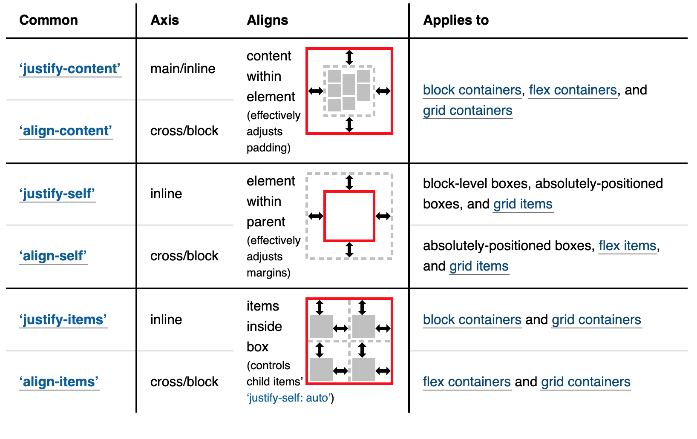

### Relevant Links

[w3 Overview of Alignment Properties](https://www.w3.org/TR/css-align-3/#overview)

### Justification

Spaces between words and between glyphs or letters are stretched or compressed in order to align both the left and right ends of consecutive lines of text.

Lorem ipsum dolor sit amet, consectetur adipiscing elit. Donec quis purus orci. Phasellus vel imperdiet leo. Curabitur eu egestas dolor, vel rutrum lacus.

So if you think about the axis and direction of the text in print which is: —>, it's easy to remember that `justify-*` aligns along the main or inline axis. The only 'justify' css property you can use with flex is `justify-content`.

> Why is there no justify-self for aligning a single flexbox child along the main-axis?

> Because there can be multiple children in that axis. The _-self properties only work if the child is all alone in that axis. When there are multiple boxes to be aligned, they can only be aligned en masse, with the _-content properties.

> [Source](https://lists.w3.org/Archives/Public/www-style/2015Apr/0114.html)
