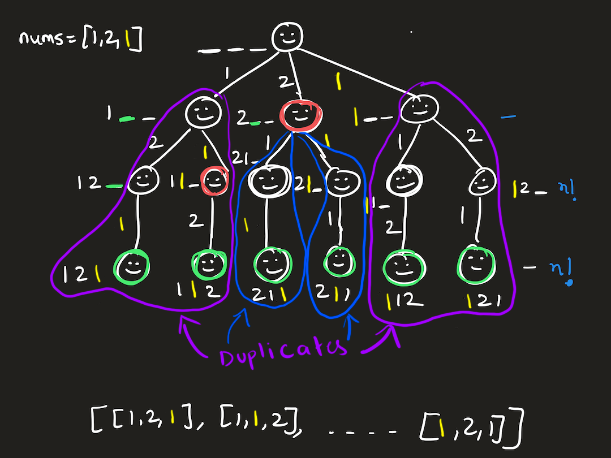

### Recursive DFS - With mutable params, no separate slate and Hash Map

```js
/* 
Time Complexity - O(n * n!)
Space Complexity - O(n * n!)
*/
function swap(arr, i, j) {
	const temp = arr[i]
	arr[i] = arr[j]
	arr[j] = temp
}

function permuteUnique(nums) {
	const result = [],
		len = nums.length

	function pHelper(i, array) {
		if (len === i) {
			result.push(array.slice(0))
			return
		}

		const hashMap = new Set()

		for (let pick = i; pick < len; pick++) {
			if (!hashMap.has(array[pick])) {
				hashMap.add(array[pick])
				swap(nums, pick, i)
				pHelper(i + 1, array)
				swap(nums, pick, i)
			}
		}
	}

	pHelper(0, nums)
	return result
}
```

<span style="display:block; text-align: center;">Tree Diagram</span>


### Recursive DFS - with slate and Hash Map

```js
function permuteUniqueSlate(nums) {
	const result = [],
		len = nums.length

	function pHelper(i, slate) {
		if (len === i) {
			result.push(slate.slice(0))
			return
		}

		const hashMap = new Set()

		for (let pick = i; pick < len; pick++) {
			if (!hashMap.has(nums[pick])) {
				hashMap.add(nums[pick])

				swap(nums, pick, i)
				slate.push(nums[i])
				pHelper(i + 1, slate)
				slate.pop()
				swap(nums, pick, i)
			}
		}
	}

	pHelper(0, [])
	return result
}

// Tests
console.log(permuteUnique([1, 1, 2]))
console.log(permuteUniqueSlate([1, 1, 2, 2]))
```
