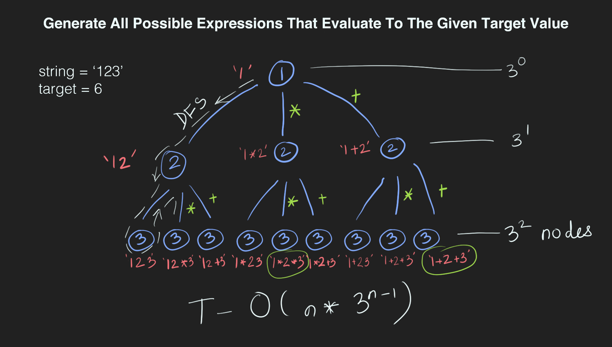

An easy variation of [this problem from leetcode](https://leetcode.com/problems/expression-add-operators/) with two operators only - `*` and `+`.



Notes and thoughts:

1. The first recursive tree that I drew recursed on `i` where `i >= 0 && i < string.length`.
2. It only had two branches for each operation — '\*' and '+'
3. I forgot about about the path that should NOT have any operators. Eg: '12+3'.
4. The `isValidExp` took me waaaay longer to figure out.
5. I know there is a way to pass the partial operated value down but
   I can't think of it right now.
6. Only one test didn't pass because it took too long, but I checked the answer and it seems right.

Observation: String concatenation is waaaay faster in JS than `arr.push()` and `arr.pop()`.

```js
// TODO: Pass partial down in dfs so the 'isValidExp' just checks partial === target at node.

function generate_all_expressions(s, target) {
	const len = s.length,
		res = []

	dfs(1, s[0])
	// dfs(1, [s[0]])
	return res

	// String concatenation much faster and code looks cleaner
	function dfs(i, slate) {
		if (i === len) {
			if (isValidExp(slate)) res.push(slate)
			return
		}

		dfs(i + 1, slate.slice(0) + s[i])
		dfs(i + 1, slate.slice(0) + '*' + s[i])
		dfs(i + 1, slate.slice(0) + '+' + s[i])
	}
	// ---------------------------------------------------
	function isValidExp(slate) {
		const nums = joinNums(slate),
			multiplied = multiply(nums)

		// Addition
		const added = multiplied.reduce((acc, curr) => {
			if (!isNaN(Number(curr))) return acc + Number(curr)
			return acc
		}, 0)

		return added === target

		// ------------------------
		function joinNums(slate) {
			let j = 0,
				n = 0
			const res = []

			while (j < slate.length) {
				let temp = slate[j]
				j++

				while (j < slate.length && slate[j] !== '*' && slate[j] !== '+') {
					temp += slate[j++]
				}

				res[n++] = temp
				res[n++] = slate[j++]
			}
			res.pop()
			return res
		}
		// ------------------------
		// Multiplication
		function multiply(nums) {
			const res = []
			let i = 0

			while (i < nums.length) {
				if (nums[i] === '*') {
					const prev = Number(res.pop())
					res.push(prev * Number(nums[i + 1]))
					i += 2
				} else {
					res.push(nums[i++])
				}
			}
			return res
		}
	}
}

// Tests
console.log(generate_all_expressions('123', 6))
let prev = Date.now()
console.log(generate_all_expressions('0000000000000', 0))
console.log((Date.now() - prev) / 1000)
```

Here's what the DFS function would be if a slate array was used instead of a string. String concatenation is MUCH faster so I didn't end up using this.

```js
function dfsSlateArr(i, slate) {
	if (i === len) {
		arr.push(slate.slice(0))
		if (isValidExp(slate)) res.push(slate.join(''))
		return
	}

	slate.push(s[i])
	dfs(i + 1, slate)
	slate.pop()

	slate.push('*')
	slate.push(s[i])
	dfs(i + 1, slate)
	slate.pop()
	slate.pop()

	slate.push('+')
	slate.push(s[i])
	dfs(i + 1, slate)
	slate.pop()
	slate.pop()
}
```
