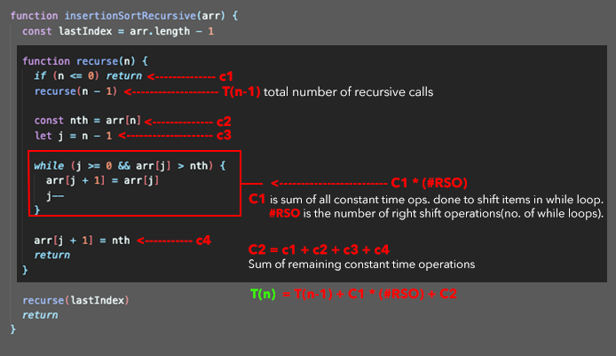

<span style="display:block; text-align: center;">Wiki pic - Graphical example of insertion sort. [Source.](https://en.wikipedia.org/wiki/File:Insertion-sort-example-300px.gif)</span>

## Iterative Insertion Sort

<!-- embed:insertion_sort_iterative.js -->

## Recursive Insertion Sort

<!-- embed:insertion_sort_recursive.js -->

### Calculating the Time Complexity of Recursive Insertion Sort




There is another way to implement recursive insertion sort - with repeated swaps to 'bubble up' the nth element.

```js
function insertionSortRecursiveBubble(arr) {
	const lastIndex = arr.length - 1

	function recurse(n) {
		// base case
		if (n <= 0) return
		// recurse on n - 1
		recurse(n - 1)
		// Bubble up and insert nth item in its place
		let j = n
		while (j >= 1 && arr[j - 1] > arr[j]) {
			swap(arr, j - 1, j)
			j--
		}
		return
	}

	recurse(lastIndex)
	return
}

function swap(array, i, j) {
	let temp = array[i]
	array[i] = array[j]
	array[j] = temp
}
```
